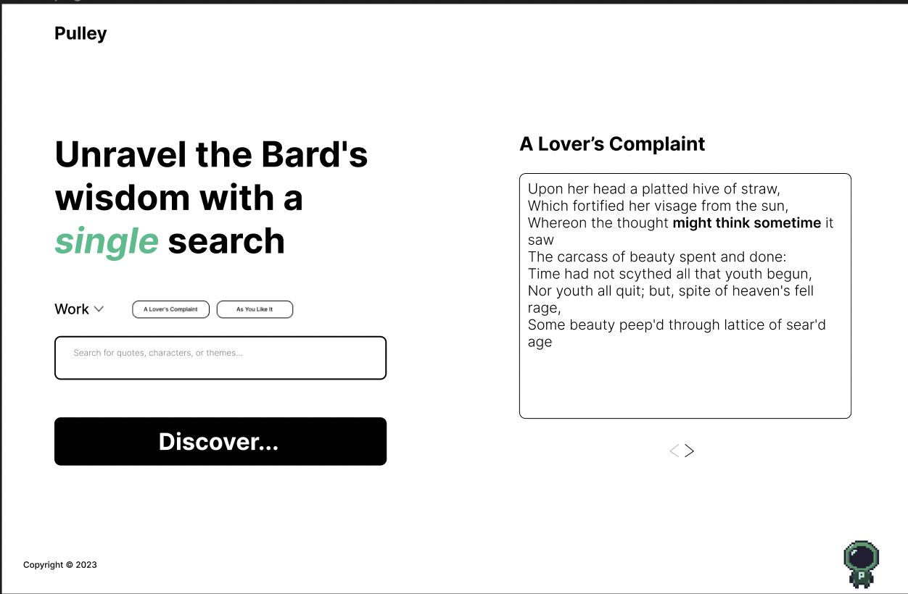
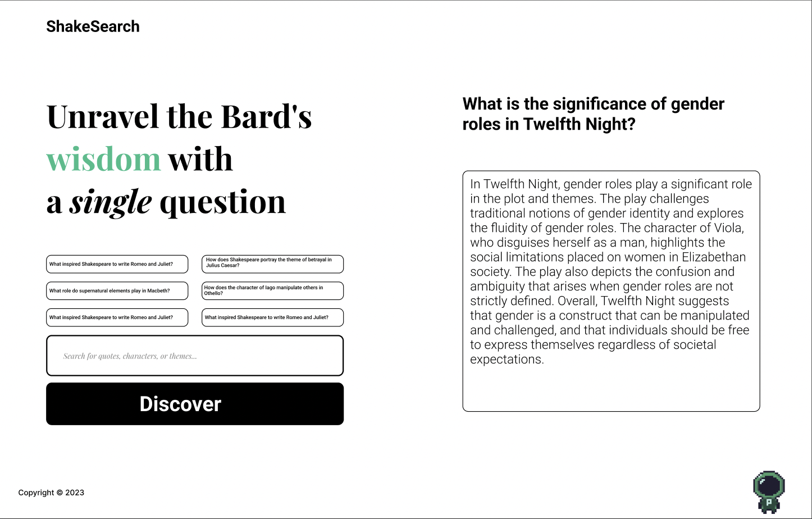
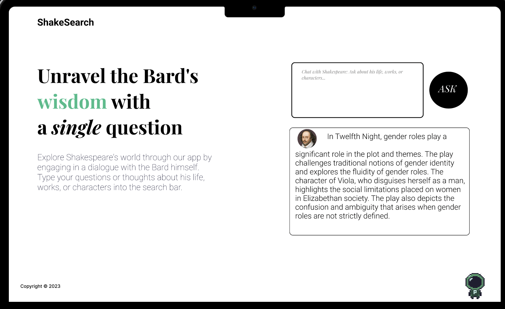
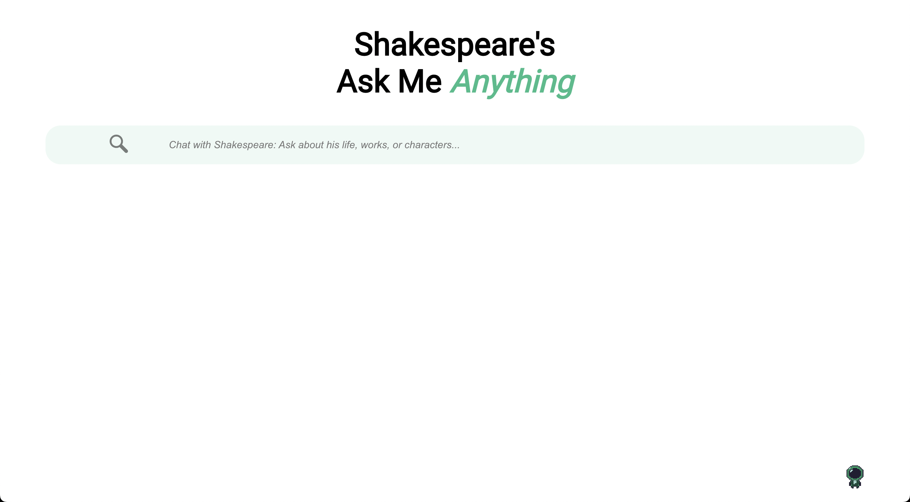
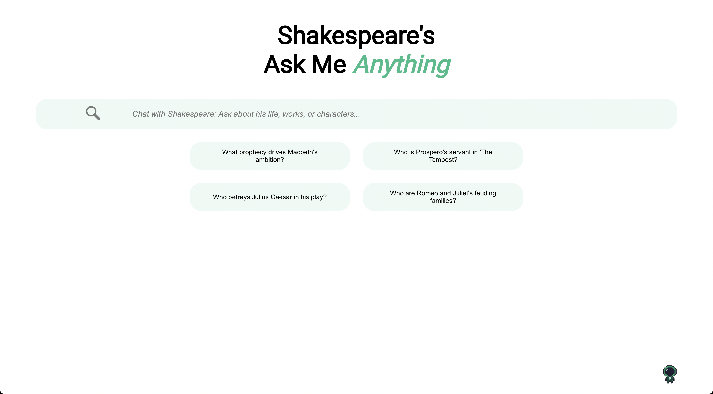
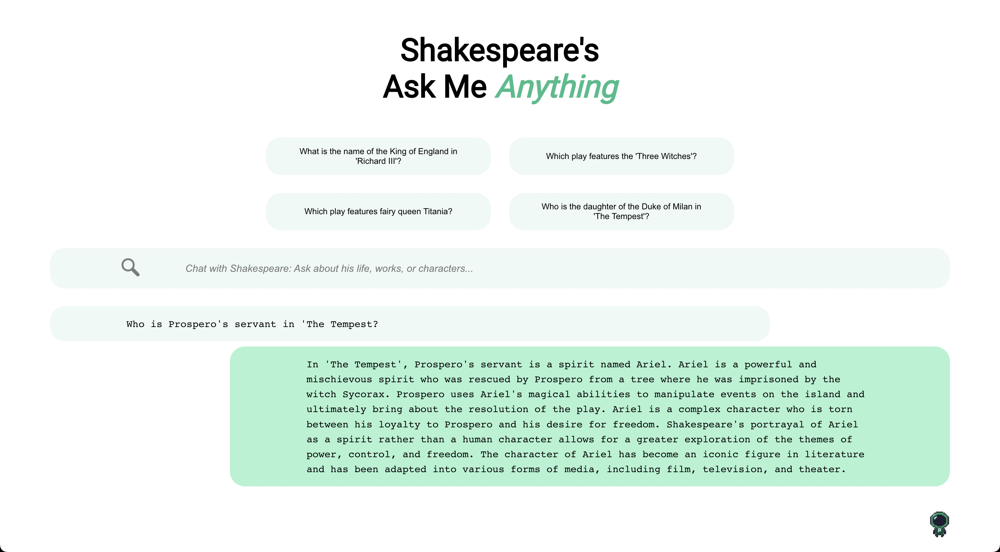

# ShakeSearch

[ShakeSearch](https://shakesearch-af6d.onrender.com/) is a chat application where you can ask anything related to Shakespeare.
The chat app provides meaningful and engaging conversations to help users learn and explore the world of Shakespeare.
The project uses a React frontend and a Go backend.

you can try it: https://shakesearch-af6d.onrender.com/

# Table of Contents

1. [Requirements](#Requirements)
2. [Installation](#Installation)
3. [Usage](#Usage)
4. [Development](#Development)
5. [Project Journey 🚀](#Journey)

# Requirements
* [Go (1.18 or newer)](https://go.dev/doc/install)
* [Node.js (18.0.0 or newer)](https://nodejs.org/en/download)
* [npm (9.0.0 or newer)](https://docs.npmjs.com/getting-started)
* [Docker](https://docs.docker.com/get-docker/)
* [OpenAI API Key](https://platform.openai.com/account/api-keys)

# Installation
### Clone the repository:
```sh
git clone https://github.com/lucianogarciaz/shakesearch.git
cd shakesearch
```
### Environment Variables
Before starting the application, you need to set the following environment variables in the .env file.
You have a .env.dist example

```sh
PORT=your-prefered-port
API_KEY=your-api-key
FRONTEND_PATH=./frontend/build
```

### Usage with docker
```sh
make docker-run
```
Open your browser and navigate to http://localhost:$(PORT).


# Development
## Only Frontend local development
```sh
npm run start
```
Then connect to localhost:3000

## Backend + Frontend
```sh
make run
```
### With docker
```sh
make docker-run
```
then connect to http://localhost:$(PORT)
### Lints
```sh
make lint # only lints
make fix # lint & fix
cd frontend
npm run lint:fix
```

# Journey
### Design
The design process was carried out using Figma.
Throughout the journey, I created and iterated on various designs, eventually settling on a simple and intuitive chat interface.

## Backend Development
For the backend, I used the mux library to implement routing and added linters to ensure code quality.
The project follows a typical scaffolding structure with /pkg and /cmd directories.
I decoupled the HTTP server from the core ask logic
and added observability using my own [open-source library](https://github.com/lucianogarciaz/kit) 🙂⭐ (it's in progress yet).

## Frontend Implementation
The frontend was built using a simple React app created with create-react-app.
CSS styling is contained in a single file. While there's room for improvement in the frontend,
my primary focus was on creating a seamless user interaction with the product.

## Iterative Design Process
### Initial Design:
The initial design included a filter for Shakespeare's works and a search input to look up specific parts of his work.


### First Redesign:
I decided to move from a simple fuzzy search algorithm to AI because it makes the interaction more fun and engaging.
Also, I added example questions for users and placed the input on the left side.
This design was found to be too text-heavy and not as user-friendly as desired.


### Second Redesign:
Moved everything to the right side (input and answer) but still faced the issue of users needing to read a lot before they could start asking questions.


### Third Redesign Inspired by Google:
Focused on the chat experience by removing unnecessary elements and creating a seamless user onboarding experience.


### Final Design:
A chat application that simulates a conversation with a Shakespearean expert, enabling users to quickly engage and learn about Shakespeare without any distractions.


And finally, since most users where using pills, I kept them fixed in the top and added a functionality to replace with
new ones each time you select one.


## Conclusion
I must say, working on ShakeSearch was fun!
Going through the various design iterations, try to understand users, and create a seamless user experience has been both fun and rewarding.
The opportunity to chat with a Shakespearean expert is undoubtedly an intriguing concept 😂

## Future Improvements
the following features and enhancements could be added to ShakeSearch:
1. **Enhance the app's handling of waiting for server responses**. Instead of displaying a message, I'd like to have something more dynamic, such as a spinner
2. **Improve Frontend**: Improve error handling for errors (currently is shown as a message in a chat) and adopt frontend best practices
3. **Store preloaded questions**. Users frequently interact with pre-loaded questions, and having them preloaded can enhance the user experience
4. **User authentication**: Implement signup and login functionality for users.
5. **Threaded conversation with ChatGPT**: Enhance the conversation by keeping a thread with ChatGPT, allowing for more context-aware interactions.
6. **Store conversations**: Keep track of user conversations, allowing users to refer back to previous discussions.
7. **Frontend tests**: Add test coverage for the React frontend components.
8. **Acceptance backend tests**: Implement acceptance tests for the Go backend.
9. **GitHub Actions**: Set up CI/CD pipelines for PRs and pushes to the master branch, including automated testing and deployment.

These improvements would significantly expand the functionality of ShakeSearch and provide a more robust user experience.
